# PlantUML Diagrams - Smart Light System

## Use Case Diagram

```plantuml
@startuml SmartLight_UseCase
!define PUML_COLOR_USER_CLASS #FFD700
!define PUML_COLOR_SYSTEM_CLASS #87CEEB
!define PUML_COLOR_DATA_CLASS #90EE90
!define PUML_COLOR_ACTOR_CLASS #FFB6C1

actor User
actor Environment

rectangle SmartLightSystem {
    usecase UC1 as "Control LED\n(Manual/Auto)"
    usecase UC2 as "Detect Motion"
    usecase UC3 as "Measure Light Level"
    usecase UC4 as "Press Button"
    usecase UC5 as "Display Status"
    usecase UC6 as "Auto-off after 10s"
    usecase UC7 as "Switch AUTO/MANUAL"
    usecase UC8 as "View Diagnostics"
    
    UC1 --> UC6 : includes
    UC1 --> UC7 : extends
    UC3 --> UC1 : triggers
    UC2 --> UC1 : triggers
    UC4 --> UC7 : triggers
    UC4 --> UC8 : long press
    UC5 --> UC1 : displays
}

User -->|Single/Double/Long Press| UC4
Environment -->|Darkness/Motion| UC3
Environment -->|Darkness/Motion| UC2
UC1 -->|Bật/Tắt| User
UC5 -->|Hiển thị| User

@enduml
```

## Sequence Diagram - Motion Detection Flow

```plantuml
@startuml MotionDetectionFlow
participant "PIR Sensor\n(GPIO3)" as PIR
participant "task_motion_sensor\n(6s priority)" as MotionTask
participant "system_event_queue\n(10 slots)" as Queue
participant "task_led_controller\n(8s priority)" as LEDTask
participant "GPIO1\n(LED)" as LED

== Initialization ==
activate MotionTask
MotionTask -> MotionTask: last_motion_state = 0

== Main Loop ==
loop Every 200ms
    MotionTask -> PIR: gpio_get_level(GPIO3)
    PIR --> MotionTask: 0 (no motion)
    MotionTask -> MotionTask: Check rising edge\nLast=0, Current=0\nNo edge detected
end

== Motion Triggered ==
PIR ->> MotionTask: Sensor HIGH (motion)
MotionTask -> PIR: gpio_get_level(GPIO3)
PIR --> MotionTask: 1 (motion detected)

MotionTask -> MotionTask: Detect rising edge\nLast=0, Current=1\n✓ Edge detected!

MotionTask -> Queue: xQueueSend(EVENT_MOTION)
activate Queue
Note right of Queue: EVENT_MOTION added\nQueue depth: 1/10

MotionTask ->> MotionTask: Log: "Motion detected"

== LED Controller Processes ==
activate LEDTask
LEDTask -> Queue: xQueueReceive(blocking)
Queue -> LEDTask: EVENT_MOTION

LEDTask -> LEDTask: Get Mutex\n(g_state_mutex)
Note right of LEDTask: Protected section

LEDTask -> LEDTask: if mode == AUTO:\n  motion_count++\n  last_motion_time = NOW

LEDTask -> LED: gpio_set_level(LED_PIN, 1)
activate LED
LED ->> LED: ⚡ LED turns ON

LEDTask -> LEDTask: led_state = true\nxTimerReset(10s)

LEDTask -> LEDTask: Release Mutex

== Next Loop ==
MotionTask -> PIR: gpio_get_level(GPIO3)
PIR --> MotionTask: (still detecting)

== After 10 seconds (if no light change) ==
LEDTask -> LEDTask: Timer expires!

LEDTask -> Queue: xQueueSend(EVENT_MOTION_TIMEOUT)
activate Queue
Note right of Queue: EVENT_MOTION_TIMEOUT\nQueue depth: 1/10

LEDTask -> Queue: xQueueReceive()
Queue -> LEDTask: EVENT_MOTION_TIMEOUT

LEDTask -> LED: gpio_set_level(LED_PIN, 0)
LED ->> LED: 🌑 LED turns OFF

deactivate LED

@enduml
```



## Sequence Diagram - Button Press Detection


## State Machine Diagram - LED Controller

```plantuml
@startuml LEDControllerStateMachine
state LEDController {
    state WaitEvent: "Waiting on Queue\n[xQueueReceive]"
    state GetMutex: "Acquire Mutex\n[xSemaphoreTake]"
    state CheckMode: "Check\nmode == AUTO?"
    
    state HandleMotion: "EVENT_MOTION\n✓ motion_count++\n✓ LED ON\n✓ Timer reset"
    
    state HandleLight: "EVENT_LIGHT\nvalue==1 (dark)?\n[yes] LED ON\n[no] LED OFF"
    
    state HandleTimeout: "EVENT_TIMEOUT\n✓ LED OFF\n✓ Timer stop"
    
    state HandlePress: "EVENT_*_PRESS\n[SINGLE] Toggle\n[DOUBLE] Auto/Manual\n[LONG] Notify OLED"
    
    state ReleaseMutex: "Release Mutex\n[xSemaphoreGive]"
    
    WaitEvent --> GetMutex: Event received
    GetMutex --> CheckMode: Mutex acquired
    
    CheckMode --> HandleMotion: EVENT_MOTION
    CheckMode --> HandleLight: EVENT_LIGHT
    CheckMode --> HandleTimeout: EVENT_TIMEOUT
    CheckMode --> HandlePress: EVENT_*_PRESS
    
    HandleMotion --> ReleaseMutex
    HandleLight --> ReleaseMutex
    HandleTimeout --> ReleaseMutex
    HandlePress --> ReleaseMutex
    
    ReleaseMutex --> WaitEvent: Loop back
}

note right of HandleMotion
    Only if mode == AUTO
    Increment motion counter
    Set LED ON (GPIO=1)
    Reset 10s timer
end note

note right of HandleLight
    Only if mode == AUTO
    Dark (value=1): LED ON
    Bright (value=0): LED OFF
    Also manage timer
end note

@enduml
```



## Component Diagram - System Architecture


## Timing Diagram - Event Timeline

```plantuml
@startuml EventTimeline
' Timeline for 20 seconds showing various events

title Smart Light System - Event Timeline (20 seconds)

concise "Light Level" as LIGHT_LEVEL
concise "Motion Detect" as MOTION
concise "LED State" as LED_STATE
concise "Timer State" as TIMER_STATE
concise "OLED Display" as OLED_DISPLAY

LIGHT_LEVEL : 30% (dark)
LIGHT_LEVEL : 30% (dark)
LIGHT_LEVEL : 92% (bright)
LIGHT_LEVEL : 94% (bright)
LIGHT_LEVEL : 30% (dark)

MOTION : no
MOTION : motion detected
MOTION : no
MOTION : motion detected

LED_STATE : OFF
LED_STATE : ON
LED_STATE : OFF
LED_STATE : ON

TIMER_STATE : stopped
TIMER_STATE : counting (10s)
TIMER_STATE : stopped
TIMER_STATE : counting (10s)

OLED_DISPLAY : updating
OLED_DISPLAY : updating
OLED_DISPLAY : normal mode
OLED_DISPLAY : diagnostic

@enduml
```

## Collaboration Diagram - Task Interaction


## All Event Types & Flow


---

*PlantUML Diagrams - Smart Light FreeRTOS System*
*Copy and paste these into PlantUML Online Editor: http://www.plantuml.com/plantuml/uml/*
